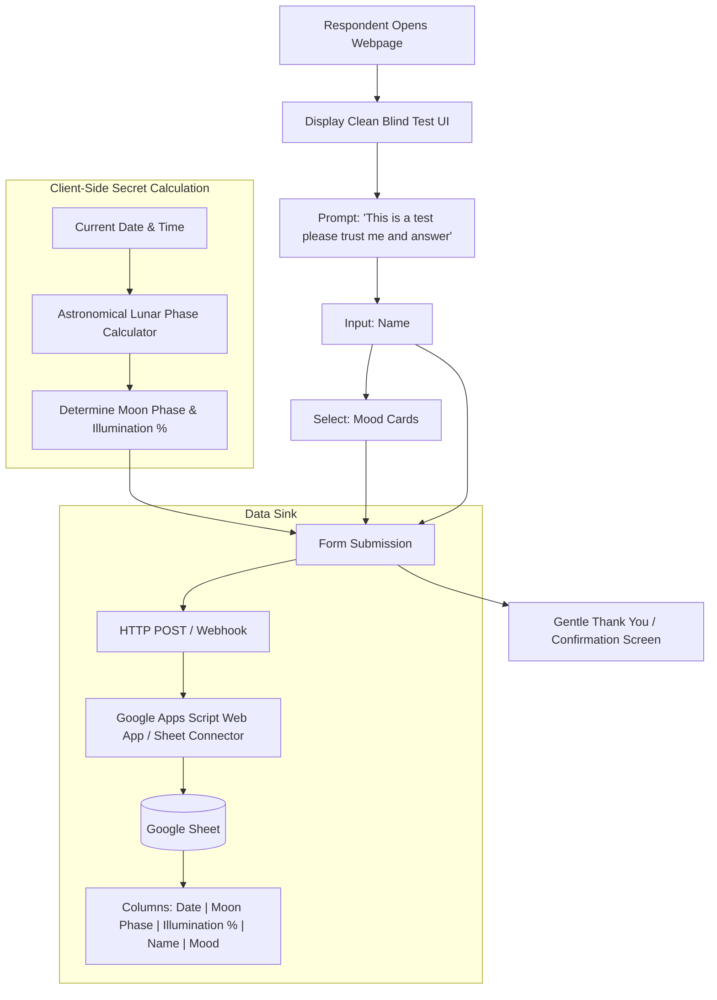

# Neural Map: LunaTick

### Logical Nodes
1. **Frontend Presentation Layer**: Minimalist, distraction-free questionnaire. Pure blind prompt. No lunar references visible to the user.
2. **Lunar Calculation Engine**: Deterministic astronomical calculation based on Julian date or synodic lunar cycle (29.53058867 days) since a known new moon epoch. Runs purely client-side without external dependencies.
3. **Data Dispatcher**: Submits payload `{ timestamp, moonPhase, moonPhaseDetail, name, mood }` via lightweight POST request to the Google Sheet backend.
4. **Backend Ingestion Layer**: Google Apps Script web app endpoint that receives JSON/URL-encoded payload and appends a row to the configured Google Sheet.
